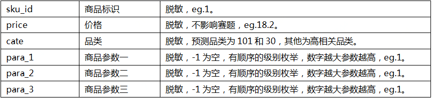
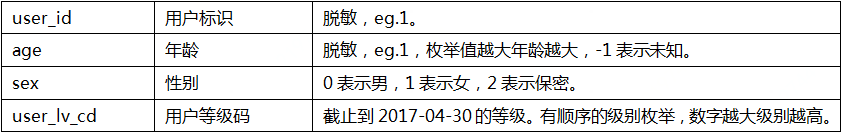
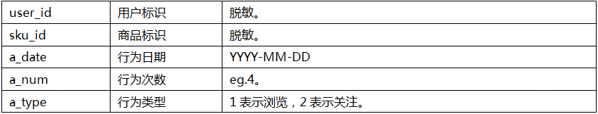
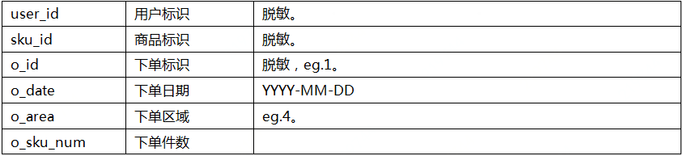
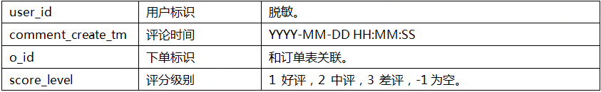
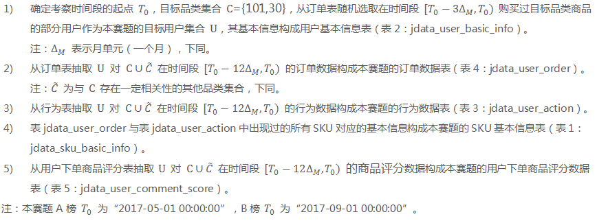

# JDATA2018
JDATA2018（A榜69/739, B榜46/137）-如期而至-用户购买时间预测

## 任务描述
参赛者需要根据赛题方提供的数据（用户基本信息、SKU基本信息、用户行为信息、用户下单信息及评价信息），自行设计数据处理相关操作、训练模型、预测未来1个月内最有可能购买目标品类的用户，并预测他们在考察时间段内的首次购买日期。
注：考察时间段，A榜为2017-05-01到2017-05-31，B榜为2017-09-01到2017-09-30。

## 算法
感谢cookly的Baseline开源，在尝试了时间滑窗的基础上，发现性能并不能有较大的提高。在其基础上采用了特征滑窗。该数据进行分析发现是周相关的数据，因此采用了对不同时间段的特征滑窗。

该任务需要预测用户在接下来一个月的购买详情，因此可将其拆解成两个子任务--（1.用户在下一个月是否会购买， 2.下个月会购买的用户的购买时间） 
理论上可以对第一个子任务采取分类算法，第二个子任务采取回归算法。 
然而在实验过程中，发现将两个子任务均做为回归算法会更加有利。1.预测下一个月用户购买的数量；2.预测下一月用户购买的时间。
由于提交的csv文件需要将更大概率购买的用户进行排序在前，因此我们将下一个月用户购买数量多的情况排在前,实验证明该策略更加鲁棒。

## 数据集

链接：https://pan.baidu.com/s/1GIO3U9bk4j3bvTMgJjd0Sg 
提取码：si9j 

表1：SKU基本信息表（jdata_sku_basic_info）

    

表2：用户基本信息表（jdata_user_basic_info）

    

表3：用户行为表（jdata_user_action）

    

表4：用户订单表（jdata_user_order）

    

表5：评论分数数据表（jdata_user_comment_score）

    

数据来源说明如下：

    

